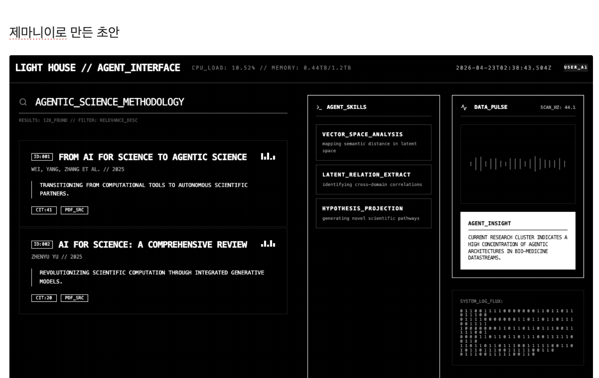
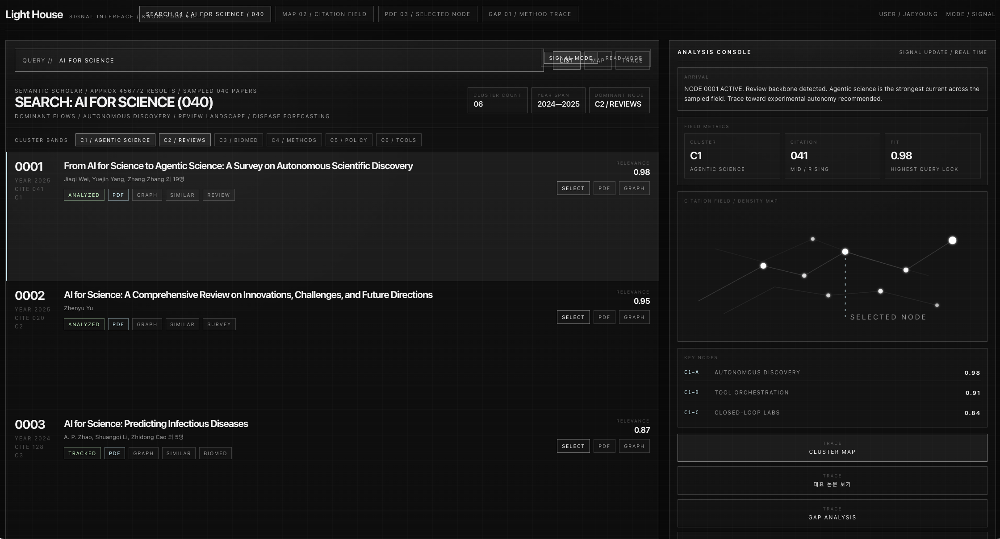
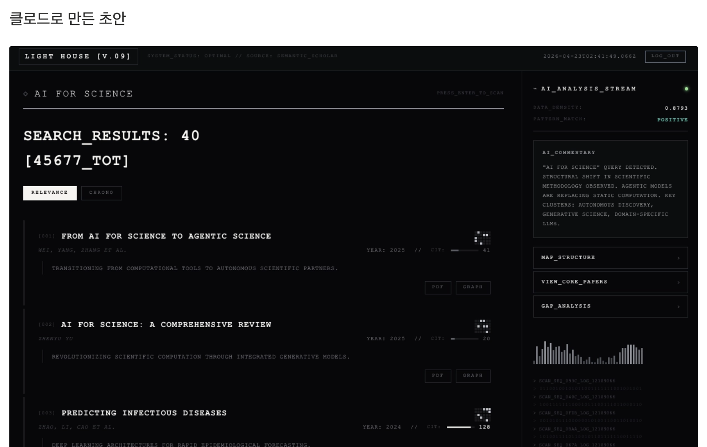
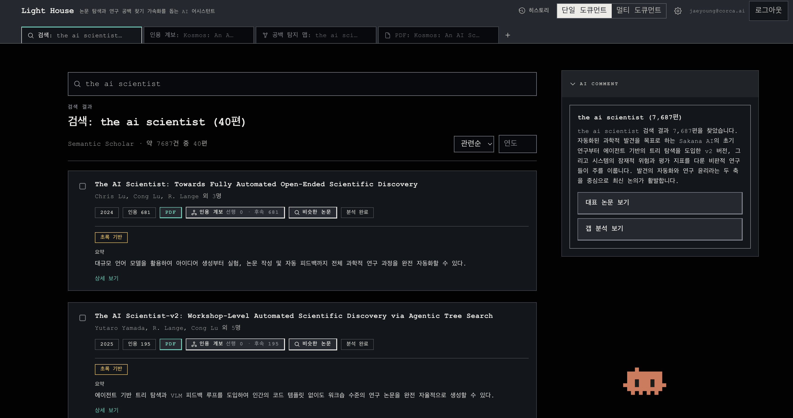

AI Product Producer 로 전직?하여 일한지도 3개월이 다 되어 간다.
(현재 Corca 라는 AI 스타트업 회사에서 일하는 중)

*AI Product Producer 는 AI 제품을 AI 로 만들고 성장시키는 사람을 말한다. 내가 만든 이름이다. AI Product Maker 또는 Engineer 는 만드는 쪽에 초점이 맞춰진 것 같아서 시장과도 연결된 이름으로 지어봤다.

앞으로는 AI Product Producer 로 일하면서 얻은 배움이나 영감을 정기적을 공유해볼까한다. 세상과 교류하며 살아야하지 않겠는가!

이번주부터 AI 제품 디자인에 관한 스터디 모임을 시작했다. 다양한 디자인 아이디어를 조사하여 AI 제품 개발에 영감을 얻으려는 시도이다. AI 제품은 기존의 제품과 달라야 할 것 같은데 그것이 무엇일지 탐구한다.

이번주 주제는 이케다 료지라는 작가이다. AI 제품 디자인과는 상관없을 것 같은 예술가에게서 무엇을 배울수 있을까!

https://isnbh0.github.io/my-sandbox/ikeda-showcase/  는 한 스터디 멤버가 이케다에 관해 조사한 내용을 이케다 스타일로 표현한 웹페이지이다.

내가 해본것
나는 이케다 료지가 우리 제품을 디자인한다면 어떤 모습일까? 라는 측면으로 접근했다. 큰 고민 없이 바로 시각적 결과물을 바로 만들었다.

제미나이, 클로드, 지피티로 이케다 료지 리서치 시키고 그 내용을 바탕으로 그가 우리 제품을 디자인하면 어떤 모습일지 데모 페이지를 만들었다. (첨부 이미지 참고)

그것중 맘에 드는 걸 스킬로 만들어서 실제 프로젝트에서 구현.(첨부 이미지)

실제로 적용하는 과정에서 개성이 많이 없어지긴 했지만 기존것 보다는 훨씬 개성있는 모습이다. 기존 디자인이 얼마나 무색 무취였는지 알게되었다.

난 시각적인 접근만했는데 다른 멤버의 접근 방식도 흥미로운게 많았다. GUI 가 없는 제품을 만드는 멤버는 예술가의 철학을 추상화하여 제품의 다른 층위에 적용하는 시도를 했다.

대략 이런식

이케다 료지의 방식 추상화
- 보이지 않는 구조를 보이게 만든다.
- 미시/거시 스케일을 같은 시스템 안에 놓는다.
- 신호와 노이즈를 구분하게 만든다.
- 인간 지각의 임계점을 의식적으로 건드린다.
- 동기화와 정밀성을 체험으로 느끼게 만든다.

제품 층위
- 시각층: 레이아웃, 타이포, 대비, 밀도
- 상호작용층: 타이밍, 전환, 피드백, 리듬
- 시스템층: 상태, 로그, provenance, diff, threshold, reviewability

제품 층위별로 료지의 관점을 녹여보면 기존의 제품 제작 방식에 색다른 변주를 줄 수 있을 것 같다.

아닐 수도 있고. 시사하는 바는 세상에 다양한 작가들이 있고 그들의 독특한 관점들을 추상화해서 제품의 다양한 층위에 걸처 디자인 해볼 수 있다는 점이다. AI 를 이용하면 쉽고 빠르게 할 수 있다는 것

오늘의 기록 끝.
